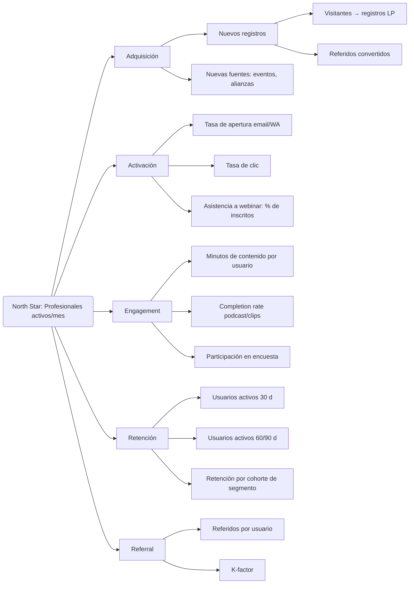
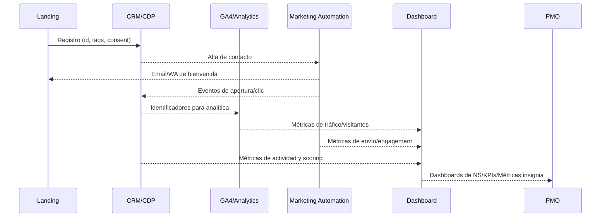

## Propósito

Definir de manera formal la métrica North Star y su árbol de indicadores que guiarán el programa. Cada KPI incluye definición, fórmula, fuente, frecuencia, responsable y umbrales 2026. Este documento servirá de referencia para el tablero de control y para las Fichas de Rumbo.

## 1. North Star Metric

### Profesionales activos al mes con interacción útil

- **Definición**: número de profesionales de la salud únicos con al menos una interacción relevante (asistencia a webinar, reproducción de podcast, clic en clip, respuesta a encuesta o referido) en el periodo de 30 días.  
- **Fórmula**: total de IDs únicos de usuario con ≥1 evento de interacción útil en un periodo de 30 días.
- **Fuente**: CRM/CDP; logs de automatización; GA4.  
- **Frecuencia**: mensual (rolling).  
- **Meta 2026**: ≥3 000 profesionales activos/mes; crecimiento mensual compuesto ≥8 %.

## 2. Árbol de KPIs (flowchart)

## 3. Tabla de KPIs

| Indicador | Definición | Fórmula | Fuente | Frecuencia | Responsable | Baseline | Meta 2026 |
|---|---|---|---|---|---|---|---|
| **Nuevos registros** | Profesionales que se registran por primera vez en cualquier canal (landing, evento). | Conteo de IDs nuevos por periodo | CRM/CDP | Semanal/Mensual | Equipo de Automatización | ~200/mes | ≥400/mes |
| **Visitantes→Registros** | Conversión de visitantes de landing a registros. | (Registros / Visitantes LP) × 100 | GA4, CRM | Semanal | Growth | 12 % | ≥20 % |
| **Referidos convertidos** | Personas que se registran por un enlace de referido | Conteo de registros con UTM de referido | CRM, UTMs | Mensual | Growth | 0 (no existe) | 100/mes |
| **Tasa de apertura email/WA** | % de mensajes abiertos sobre enviados | (Mensajes abiertos / Mensajes enviados) × 100 | Marketing automation | Semanal | Mktg Operaciones | 25 % | ≥40 % |
| **Tasa de clic** | % de clics en CTA sobre mensajes abiertos | (Clics únicos / Mensajes abiertos) × 100 | Marketing automation | Semanal | Mktg Operaciones | 10 % | ≥20 % |
| **Asistencia a webinar** | % de inscritos que se conectan en vivo | (Usuarios conectados / Inscritos) × 100 | Zoom, CRM | Por evento | Product Owner | 20 % | ≥35 % |
| **Minutos de contenido** | Tiempo total de consumo de contenidos derivados (podcast, clips, webinars). | Σ minutos de reproducción por usuario | GA4, YouTube/Spotify API | Mensual | Content Lead | N/D | ↑ 25 %/trimestre |
| **Completion rate** | % de usuarios que completan ≥80 % de un contenido. | (Usuarios que completan ≥80 % / Usuarios que iniciaron) × 100 | Reproductor, GA4 | Mensual | Content Lead | N/D | ≥40 % |
| **Participación en encuesta** | % de asistentes que contestan la encuesta post‑evento. | (Respuestas / Asistentes) × 100 | Typeform/CRM | Por evento | Operations | 15 % | ≥30 % |
| **Usuarios activos 30/60/90 d** | Profesionales que han interactuado con al menos un contenido en los últimos 30/60/90 días. | Conteo de IDs únicos | CRM/CDP | Mensual | BI/Data | 500/400/300 | 1500/1200/900 |
| **Retención por cohorte** | Porcentaje de usuarios de una cohorte (mes de registro) que permanecen activos en períodos posteriores. | Cohort retention chart | CRM/CDP | Mensual | BI | N/D | ↑ 5 p.p. trimestral |
| **Referidos por usuario** | Número promedio de registros referidos por usuario activo. | Σ referidos / Σ usuarios activos | CRM/CDP | Mensual | Growth | 0 | 0.3 |
| **K‑factor** | Coeficiente de viralidad: registrados de referidos / usuarios activos. | Referidos / Usuarios activos | CRM/CDP | Mensual | Growth | 0 | ≥0.3 |
| **ILT** | Índice de liberación de talento (horas liberadas en marketing y producción). | (Horas liberadas / Horas totales) × 100 | Registros de tiempo, RPA logs | Mensual/Trimestral | PMO | N/D | ≥25 % |
| **TAV** | Días desde kickoff hasta primer indicador de valor (p. ej., primer patrocinio o alianza). | Fecha de primer valor – Fecha inicio | PMO | Por proyecto | PMO | N/A | ≤90 d |
| **VNR** | Valor neto recurrente: ΔIngresos + Ahorros – Costes | Contabilidad, CRM | Trimestral | CFO | N/A | ↑ trimestre a trimestre |
| **RFE** | Reducción de fricción del equipo | NPS interno y encuesta de fricción | HRIS/Encuestas | Trimestral | People Ops | N/D | NPS ≥40 |
| **Confiabilidad operativa** | Uptime y tasa de fallos de automatizaciones | (Ejecuciones exitosas / Totales) × 100 | Observabilidad | Mensual | DevOps | 95 % uptime | ≥99 % |

### Notas

- Baselines preliminares se definirán durante la fase de diagnóstico (0–30 días).  
- Los umbrales se revisarán cada trimestre durante los QBR.

## 4. Relación con las métricas insignia IA 10×

Las métricas insignia de IA 10× (ILT, TAV, VNR, RFE, Confiabilidad) son transversales al árbol. Se utilizan para calcular el retorno económico y el impacto humano liberado. Estos indicadores se reportan al comité directivo y sirven para ajustar la inversión en automatización y contenido.

## 5. Responsibilities & Governance

- **Data & Analytics**: BI Manager — asegura la captura, limpieza y reporting de KPIs; mantiene el dashboard.  
- **Marketing & Growth**: responsable de adquisición y activación; experimentación y optimización de campañas.  
- **Content Lead**: monitoriza engagement y completion; ajusta formatos y temáticas.  
- **Operations**: vigila retención y participación en encuestas; ejecuta nurturing.  
- **Product/PMO**: administra ILT, TAV y VNR; reporta avances a la dirección.  
- **DevOps/Automation**: garantiza confiabilidad operativa.

## 6. Flujo de datos

**Este flujo representa la ingestión y transformación de datos desde la captación hasta la visualización, asegurando que todas las métricas del árbol se nutran de fuentes confiables.**
