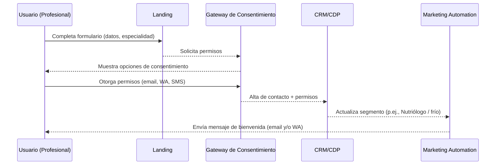
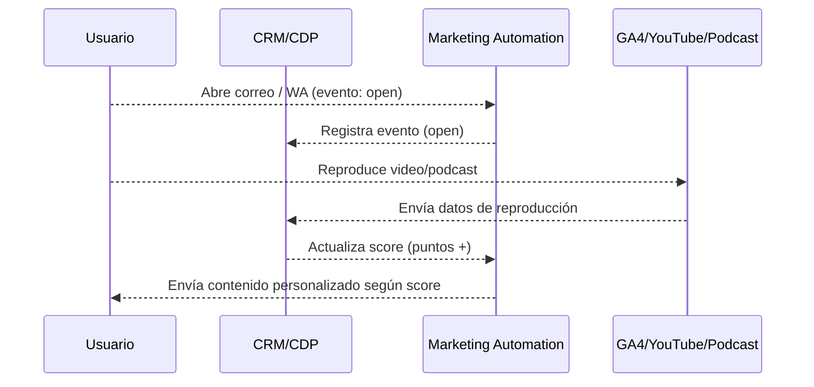
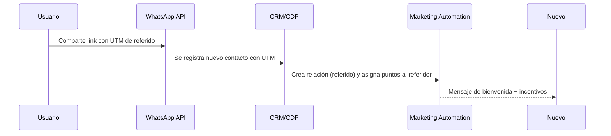

## Propósito
Definir la arquitectura técnica y de datos para soportar la estrategia de Conexión Saludable 2026. Este blueprint describe los componentes principales, flujos de integración y consideraciones de escalabilidad y seguridad.

## Componentes
1. **Landing Pages (LP)**: plantillas responsivas diseñadas para capturar datos y consentimientos. Incorporan UTMs para identificar fuente y campaña.
2. **Gateway de consentimiento**: módulo que gestiona permisos (email, WhatsApp, SMS) acorde con normativas de privacidad.  
3. **CRM/CDP**: base de datos centralizada que almacena perfiles, atributos demográficos (especialidad, edad, localidad), comportamientos (aperturas, clics, asistencias, reproducciones, shares) y puntos de scoring. Permite segmentar y exportar listas dinámicas.
4. **Marketing Automation (MA)**: plataforma que ejecuta journeys, envía emails, mensajes de WhatsApp vía API y SMS, gestiona AB tests y personalización. Debe integrarse de forma bidireccional con CRM/CDP.
5. **WhatsApp Business API**: canal transaccional y conversacional para recordatorios, contenidos y referidos. Se integra mediante Webhook con el MA.
6. **Repositorio de contenido**: almacenamiento de archivos multimedia (videos, audios, documentos) con metadatos. Permite versionado y acceso desde landings y mensajes.
7. **Analytics & Dashboard**: plataforma BI que unifica datos de GA4, CRM, MA, WhatsApp y redes sociales. Incluye cálculos de KPIs, métricas insignia y reportes de cohortes.
8. **Security & Compliance**: módulo de autenticación y control de roles; cifrado de datos en tránsito y reposo; políticas de retención y eliminación.

## Flujos principales
### 1. Registro y consentimiento

### 2. Captura de eventos y scoring

### 3. Referidos por WhatsApp

## Consideraciones técnicas
- **Escalabilidad**: diseñar la CDP para soportar el crecimiento esperado (>10 000 registros en 2026) y la ingesta de eventos de streaming (podcast, video).  
- **Integración**: usar API REST/Webhooks; establecer ETL para exportar datos a BI.  
- **Seguridad**: cifrado TLS, control de accesos basado en roles (consultor, operativos, director).  
- **Legalidad**: cumplir con Ley Federal de Protección de Datos y estándares GDPR (consentimiento explícito, derecho de eliminación).

## Acciones de implementación
1. Seleccionar herramienta de CRM/CDP flexible (p. ej., HubSpot, Zoho, Braze o plataforma open source).  
2. Configurar campos estándar, etiquetas y listas dinámicas.  
3. Integrar WhatsApp Business API con el MA elegido; definir plantillas certificadas para recordatorios y referidos.  
4. Implementar script de UTMs en landings y en links de WA/email.  
5. Crear esquema de scoring inicial (ver [Modelo de Scoring](2.1 Modelo de Scoring – Lead & Engagement.md)).  
6. Configurar API de podcasts (Spotify, Apple) y YouTube para capturar reproducciones; consolidar datos en CRM.

## Métrica de éxito
El blueprint será exitoso si permite el registro centralizado con tracking de eventos para ≥90 % de contactos, soporta segmentación dinámica y facilita la ejecución de journeys automatizados con confiabilidad ≥99 %.
