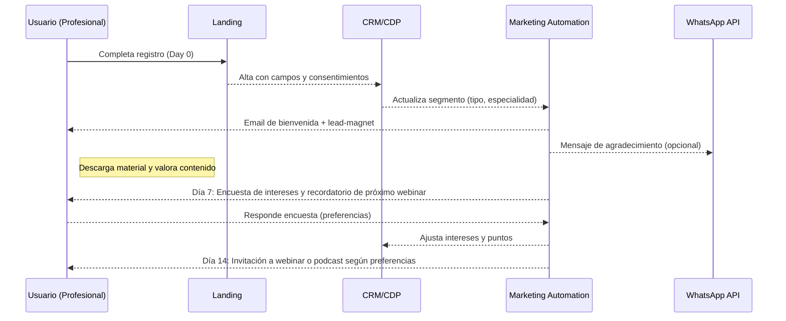
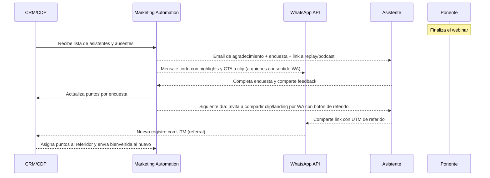
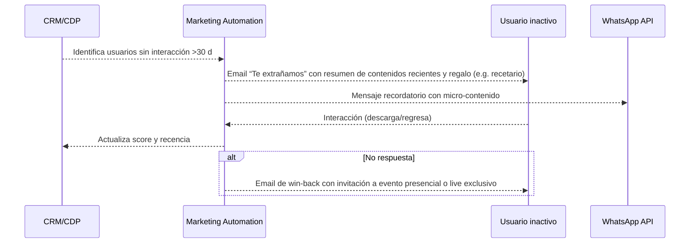
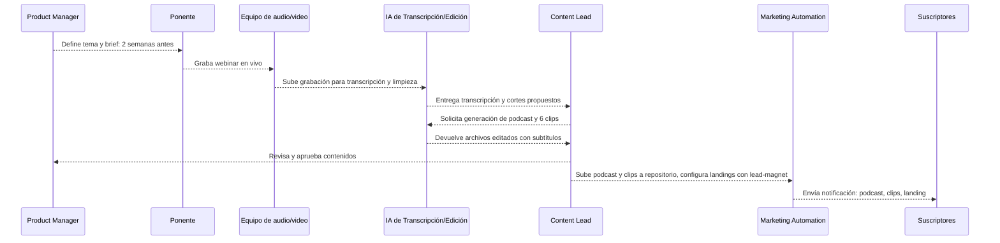
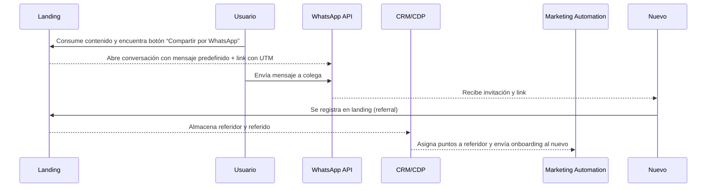
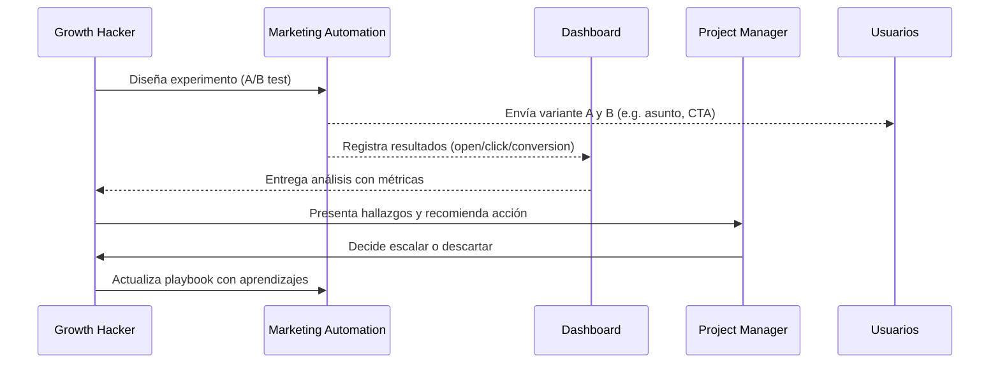

## Propósito

Diseñar los flujos de comunicación automatizada que acompañan al usuario desde el primer contacto hasta su fidelización. Cada journey se representa con un diagrama de secuencia Mermaid, mostrando actores y mensajes clave.

## 1. Onboarding de 14 días
**Objetivo**: dar la bienvenida, calificar intereses y motivar la primera interacción.

## 2. Post‑evento (webinar)
**Objetivo**: agradecer la asistencia, capturar feedback y fomentar consumo on‑demand y referidos.

## 3. Reactivación 30 días

**Objetivo**: recuperar usuarios inactivos y estimular nuevas interacciones.

## 4. Fábrica de contenidos (webinar→podcast/clips/landing)

**Objetivo**: estandarizar el pipeline de producción y publicación de contenidos derivados.

## 5. Referidos por WhatsApp

**Objetivo**: activar el crecimiento orgánico mediante el botón de compartir y seguimiento de referidos.

## 6. Hipótesis→Experimento→Decisión→Playbook

**Objetivo**: documentar el ciclo de aprendizaje y mejora continua.

**Nota**: Cada experimento se prioriza con la matriz ICE (Impacto, Confianza, Esfuerzo) y se registra en el tablero de experimentación (ver [Plan de Experimentación](43%20Plan%20de%20Experimentación%20A-B%20y%20Ritmo%20de%20Sprints.md)).
