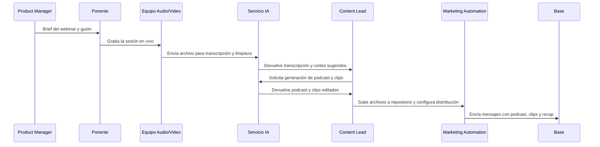

## Propósito
Convertir cada webinar en múltiples activos de contenido para maximizar su impacto y alcanzar a la audiencia en diferentes formatos y canales.

## 1. Preparación
- **Selección de tema**: alineado a efemérides, intereses de la audiencia y pilares de salud (femenina, digestiva, mental).  
- **Brief para ponentes**: instrucciones claras, duración sugerida (45–60 min), preguntas frecuentes, indicaciones de calidad audiovisual.  
- **Lead‑magnet**: definir regalo de valor (recetario, calculadora de calorías, tabla de suplementos) que se ofrecerá en la landing.  
- **Definición de UTM**: establecer parámetros para cada pieza (webinar, podcast, clip) para rastreo.

## 2. Grabación y captura
1. **En vivo**: utilizar Zoom o plataforma similar con buena calidad de audio y video. Solicitar a los ponentes que usen micrófonos adecuados y fondo neutro.  
2. **Backups**: grabar localmente y en la nube. Capturar pantalla del chat de preguntas para integrarlo en el recap.

## 3. Postproducción
- **Transcripción**: subir el archivo de audio/video a un servicio de IA para transcribir (e.g. Whisper).  
- **Limpieza de audio**: eliminar silencios, mejorar volumen y calidad.  
- **Creación de podcast**: editar el audio a 20–30 min; agregar intro/outro de marca; exportar en formato mp3.  
- **Cortes para clips**: identificar 6–10 momentos clave de 40–90 segundos; agregar subtítulos; formatear a vertical (9:16); insertar call‑to‑action.
- **Resúmenes y artículos**: redactar un resumen de 700–1000 palabras con insights, bullets y referencias; crear 1–2 infografías o carruseles con datos relevantes.  
- **Artwork**: diseñar portada para podcast y thumbnails para clips (usar paleta de Granvita).  

## 4. Publicación y distribución
1. **Podcast**: subir a plataformas (Spotify, Apple, Google).  
2. **Clips**: publicar en YouTube Shorts, Instagram Reels y TikTok (si aplica) con copy atractivo.  
3. **Recap**: publicar artículo en blog o landing con imágenes y recursos descargables; incluir formulario de registro y botón de share.  
4. **Email/WhatsApp**: enviar notificación a la base con los nuevos contenidos; personalizar mensaje según segmentación y preferencias de formato.  
5. **Redes sociales**: programar posts a lo largo de la semana; incluir testimonios del ponente y llamadas a la acción para compartir.

## 5. Seguimiento y medición
- **KPIs de contenido**: reproducciones totales, completion rate, shares, conversiones (registros generados desde contenido), comentarios/feedback.  
- **Etiquetas**: usar etiquetas en CRM para usuarios que consumen podcast, clips o artículos; alimentan el scoring y segmentación.  
- **Aprendizaje**: revisar cuál formato genera mayor engagement; ajustar el número de clips o la duración del podcast según resultados.

## 6. Secuencia Mermaid del pipeline

## 7. Métrica de éxito
El playbook se considera exitoso cuando cada webinar produce al menos un podcast y 6 clips, se publican en un plazo ≤72 horas y logran un total de reproducciones que supera en 50 % al alcance del webinar en vivo. Además, al menos el 10 % de los consumidores comparte los contenidos.
