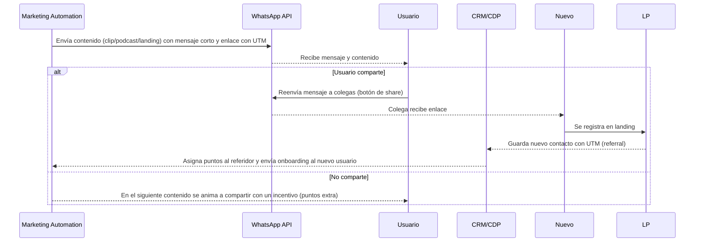

## Propósito
Establecer las mejores prácticas para amplificar contenidos y capturar referidos a través de WhatsApp. Este canal es crucial porque concentra 12 grupos activos【645910007767094†L156-L164】 y permite la viralidad orgánica.

## 1. Principios de comunicación en WhatsApp
1. **Personalización**: dirigirse al profesional por su nombre y mencionar su especialidad cuando sea posible.  
2. **Brevedad**: mensajes de máximo 3–4 líneas; incluir emojis con moderación.  
3. **Claridad en la acción**: un solo CTA por mensaje (registrarse, escuchar, compartir).  
4. **Valor inmediato**: ofrecer el beneficio antes de pedir la acción (p. ej. “Te comparto un podcast de 5 min sobre microbioma…”).  
5. **Horario óptimo**: enviar mensajes entre 6 p.m. y 9 p.m., que es cuando la audiencia está disponible【645910007767094†L116-L125】.

## 2. Flujo de distribución y referidos

## 3. Plantillas de WhatsApp

- **Invitación a webinar**:
  > Hola {nombre}, 🎧 te invitamos a nuestro próximo webinar “{tema}” el {fecha} a las {hora}. Regístrate aquí: {link}. ¡Te esperamos!

- **Entrega de podcast**:
  > ¡Hola {nombre}! Ya está disponible el podcast sobre {tema} que te prometimos. Escúchalo aquí: {link} 🎙️ y compártelo con tus colegas.

- **Compartir lead‑magnet**:
  > ¿Sabías que puedes calcular fácilmente las calorías de tus pacientes? Descarga nuestra plantilla gratuita aquí: {link} 🍏 y compártela con quien le pueda servir.

- **Programa de lealtad**:
  > {nombre}, ya acumulaste {puntos} ojuelitas 🎁. Comparte este contenido y gana puntos extra: {link}.

## 4. Incentivos para referidos
- **Puntos dobles** cuando el referido se registra en la misma semana.  
- **Descuentos** en productos de Granvita o acceso prioritario a eventos presenciales.  
- **Reconocimiento** en la comunidad (medalla digital) para los Top 10 referidores del trimestre.

## 5. Medición y optimización
- **K‑factor** = referidos convertidos / usuarios activos. Objetivo ≥0.3.  
- **CTR de WhatsApp**: monitorizar clics en enlaces; optimizar el copy y los horarios.  
- **Tasa de conversión de referidos**: ratio de registros provenientes de referidos.  
- **Feedback**: solicitar a los usuarios qué tipo de contenidos desean compartir.

## 6. Consideraciones legales
- Obtener consentimiento explícito para comunicaciones por WhatsApp y uso de números telefónicos.  
- Informar que los datos del referido se utilizarán únicamente para fines educativos y comerciales de Granvita.  
- Permitir que los usuarios se den de baja de la lista de difusión en cualquier momento.
