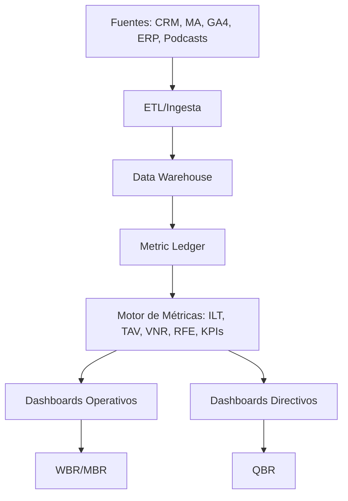

## Propósito

Establecer las reglas y procesos para medir el desempeño del programa Conexión Saludable y atribuir el valor generado a las diferentes actividades, canales y contenidos. Este plan garantiza que las decisiones se basen en datos confiables y que se pueda demostrar el retorno de inversión del programa.

## 1. Fuentes de datos

| Fuente | Datos capturados | Comentarios |
|---|---|---|
| **CRM/CDP** | Registros de usuarios, eventos de comportamiento, puntuaciones de scoring, referidos, puntos de lealtad | Debe ser la “única fuente de verdad” para perfiles y puntuaciones |
| **Marketing Automation** | Métricas de envíos, aperturas, clics y conversiones de email/WhatsApp/SMS | Integrado con CRM mediante API |
| **GA4 & YouTube Analytics** | Visitas a landings, completion de vídeos, fuentes de tráfico | Configurar UTMs y eventos personalizados |
| **Podcast analytics** (Spotify/Apple) | Reproducciones, tiempo de escucha, ubicación geográfica | Consolidar con CRM para unificar ID de usuario si se dispone de autenticación |
| **Encuestas** (Typeform/Forms) | Satisfacción, NPS, RFE | Integrar con CRM para actualizar campos |
| **ERP/Contabilidad de Granvita** | Ventas, costos, ingresos por patrocinio | Permite calcular VNR |
| **Observabilidad de IA/Automatizaciones** | Uptime, tasa de fallos, MTTR | Alimenta Confiabilidad operativa |

## 2. Modelo de atribución
Se utilizará un esquema híbrido:

- **First Touch / Last Touch**: para analizar la efectividad de campañas de adquisición y de conversión respectivamente.
- **Atribución lineal**: para asignar valor equitativo a múltiples interacciones durante el journey (por ejemplo, webinar + podcast + clip + referidos).
- **Modelo incremental**: con grupos de control para medir el impacto de nuevas iniciativas (p. ej. programa de lealtad).

## 3. Minimum Measurability Environment (MME)
Basado en las recomendaciones de las Métricas Insignia IA 10×:

1. **Definiciones aprobadas**: reutilizar las definiciones del [KPI Tree](../1 Estrategia/1.2 North Star & KPI Tree – Conexión Saludable 2026.md).  
2. **Baseline**: documentar 3–6 meses de datos históricos previos a la implementación.  
3. **Fuentes conectadas**: asegurar que CRM, MA, GA4, redes y ERP envíen datos a un lago común o data warehouse.  
4. **Metric ledger**: registrar las versiones de fórmulas y valores calculados con sellos de tiempo para auditoría.  
5. **Calendario de cierre**: establecer cortes mensuales y cierres trimestrales para reportar ILT, TAV, VNR, RFE y Confiabilidad.  
6. **Comité de medición**: 30 min/mes para revisión de métricas, edge cases y exclusiones.

## 4. Pipeline de medición

## 5. Validación de datos y calidad
- Configurar alertas para detectar anomalías (picos o caídas inesperadas).  
- Revisar las reglas de deduplicación y merge en el CRM.  
- Realizar auditorías trimestrales de datos (muestras aleatorias).  
- Implementar control de versiones en definiciones de métricas.

## 6. Atribución a campañas y contenidos
- Para cada campaña (email, WA, paid social), asignar un **Campaign ID** y UTMs.  
- Medir conversiones en landings y asignar crédito a los canales de origen.  
- Atribuir la reproducción de contenidos a la campaña de difusión más cercana (ventana de 7 días).  
- En referidos, otorgar 100 % del valor al referidor y registrar la fecha para valorar recurrencia.

## 7. Métrica de éxito
Se considera que el plan de medición funciona cuando:

- El dashboard muestra datos consistentes y confiables (>95 % de concordancia entre fuentes).  
- Los stakeholders confían en las métricas para tomar decisiones.  
- Se pueden rastrear ingresos y ahorros hasta actividades específicas (VNR).  
- Los ajustes de marketing mejoran las métricas clave en ciclos trimestrales.
