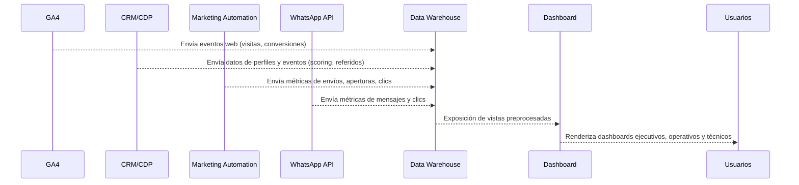

## Propósito
Especificar las vistas y requisitos técnicos del tablero de control que consolidará datos de GA4, CRM/CDP, plataforma de Marketing Automation y WhatsApp API. Este dashboard será la herramienta principal para monitorear el programa y tomar decisiones.

## 1. Vistas del dashboard

### 1.1 Vista Ejecutiva (Directores)
- **Resumen del North Star**: número de profesionales activos mes‑a‑mes y tendencia.  
- **KPIs Clave**: nuevos registros, K‑factor, minutos de contenido, retención (30/60/90), ILT, TAV, VNR.  
- **Panel de patrocinios**: ingresos por patrocinios, número de sponsors, coste vs. beneficio.  
- **Alertas**: tarjetas rojas/amarillas cuando algún KPI cae por debajo del umbral.

### 1.2 Vista Operativa (Marketing/Contenido)
- **Funnel de adquisición**: visitantes → registros → asistentes → activos; desglosado por fuente (UTM).  
- **Desempeño de campañas**: tasas de apertura, clic y conversión por campaña de email/WA; desempeño comparado de canales.  
- **Consumo de contenidos**: reproducción de podcasts, clips y webinars; completion rate; top temas.  
- **Scoring y segmentos**: distribución de contactos por estado (frío/tibio/caliente) y su evolución.  
- **Referidos**: número de referidos, K‑factor, principales referidores.

### 1.3 Vista Técnica (Automatización/DevOps)
- **Confiabilidad operativa**: uptime de flujos, tasa de fallos, MTTR.  
- **Eventos por segundo**: volumen de eventos ingestado por hora/día.  
- **Latencia**: tiempo entre eventos y actualización en el CRM.  
- **Alertas de seguridad**: intentos de acceso no autorizado, fallos de entrega de WA/email.

## 2. Requisitos técnicos
- **Data warehouse**: centralizar datos de GA4, CRM/CDP, MA y WA en un entorno de consulta (BigQuery, Redshift, Snowflake).  
- **ETL/ELT**: pipelines automatizados que carguen los datos con intervalos máximos de 1 hora para métricas operativas y 24 horas para métricas financieras.  
- **Modelo de datos**: tablas normalizadas para usuarios, eventos, campañas, referidos, patrocinios y métricas insignia.  
- **Herramienta de BI**: elegir solución (Looker, Tableau, Metabase, Power BI); configurar roles y permisos.  
- **Actualizaciones en tiempo real**: para KPIs tácticos (visitas, registros, aperturas), se requiere streaming o near‑real‑time (≤5 min).  
- **Compatibilidad multicanal**: integrar API de WhatsApp y email para capturar métricas de entrega y engagement.  
- **Notificaciones automáticas**: configurar alertas por correo/Slack cuando métricas clave se desvíen.

## 3. Secuencia de ingestión y visualización

## 4. Roles de acceso

| Rol | Permiso | Herramienta |
|---|---|---|
| **Directivo** | Leer todas las vistas ejecutivas; exportar reportes | BI |
| **Marketing/Contenido** | Leer vistas operativas; ejecutar filtros y comparaciones; crear visualizaciones personalizadas | BI |
| **Automatización/DevOps** | Leer vistas técnicas; configurar alertas; administrar integraciones | BI & DW |
| **Analista de datos** | Acceso de escritura al Data Warehouse; crear modelos y métricas; versionar métricas | DW |
| **Consultor Toracom** | Lectura y sugerencias; soporte en KPIs y experimentos | BI |

## 5. Métrica de éxito
El dashboard se considerará exitoso cuando:

- Proporcione datos actualizados en tiempo real (≤5 min de retraso) para KPIs tácticos.  
- Sea utilizado semanalmente por todos los roles definidos.  
- Permita identificar insights accionables (ajustes de campañas, oportunidades de patrocinio).  
- Reduce el tiempo de preparación de reportes en al menos un 50 %.  
- Sea la fuente de información principal para las WBR, MBR y QBR.
