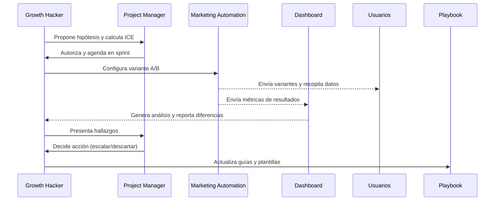

## Propósito
Establecer un proceso estructurado para probar hipótesis de marketing, contenidos y productos, con el fin de mejorar continuamente los KPIs. Este plan proporciona la matriz ICE de priorización, el calendario de sprints y la documentación requerida.

## 1. Matriz ICE (Impacto, Confianza, Esfuerzo)
Para cada experimento se evalúa:

| Experimento | Impacto (1–5) | Confianza (1–5) | Esfuerzo (1–5) | ICE Score |
|---|---|---|---|---|
| Asunto personalizado con IA vs. genérico | 4 | 3 | 2 | 5.5 |
| CTAs en WhatsApp con emoji vs. sin emoji | 3 | 4 | 1 | 7.0 |
| Horario de envío (mañana vs. noche) | 2 | 5 | 1 | 7.0 |
| Landing con video teaser vs. imagen estática | 4 | 2 | 3 | 5.0 |
| Programa de referidos con puntos dobles en la primera semana | 5 | 3 | 3 | 5.3 |
| Podcast de 15 min vs. 30 min | 3 | 3 | 2 | 4.0 |
| Encuesta de un clic post‑consumo vs. encuesta larga | 2 | 4 | 1 | 6.0 |
| Evento presencial piloto (CDMX vs. GDL) | 4 | 2 | 4 | 3.0 |

Los experimentos con mayor **ICE Score** se priorizan en los próximos sprints.

## 2. Calendario de sprints

| Sprint | Duración | Objetivos | Experimentos incluidos | Productos entregables |
|---|---|---|---|---|
| **Sprint 1** | Semanas 1–2 | Quick wins; mejorar apertura y clics | • Asunto personalizado IA vs. genérico  
• Emoji en CTAs  
• Horario de envío | Reporte de resultados en WBR; actualización de playbook |
| **Sprint 2** | Semanas 3–4 | Optimizar conversión en landing | • Video teaser vs. imagen  
• Encuesta de un clic | Informe de MBR; mejoras en plantillas |
| **Sprint 3** | Semanas 5–6 | Activar referidos y viralidad | • Puntos dobles por referido  
• Podcast 15 min vs. 30 min | Informe quincenal; ajustes al programa de lealtad |
| **Sprint 4** | Semanas 7–8 | Probar eventos presenciales piloto | • CDMX vs. GDL  
• Feedback y NPS presencial | Informe de QBR; decisión sobre escalamiento |

Cada sprint termina con un reporte que incluye: hipótesis, resultados, significancia (si aplica), aprendizaje y decisión (escalar, modificar o descartar).

## 3. Ciclo de experimentación

## 4. Documentación
- **Registro de experimentos**: hoja o base de datos con columnas: ID, fecha de inicio, hipótesis, variantes, duración, métricas primarias, ICE score, resultados, decisión.  
- **Plantillas de reporte**: formato para presentación en WBR/MBR/QBR con visualizaciones y aprendizajes.  
- **Repositorio de playbooks**: documentos actualizados con los hallazgos (e.g. mejores prácticas de asuntos de email, CTA en WA, longitud de podcast).

## 5. Métrica de éxito
El plan se considera exitoso si:

- Se ejecutan ≥80 % de los experimentos programados por trimestre.  
- Al menos 30 % de los experimentos generan mejoras significativas (p < 0.05) en KPIs.  
- Los hallazgos se integran en el playbook y se reflejan en mejoras sostenidas de métricas (apertura, conversión, retención).  
- El proceso se adopta como rutina de mejora continua por el equipo.
