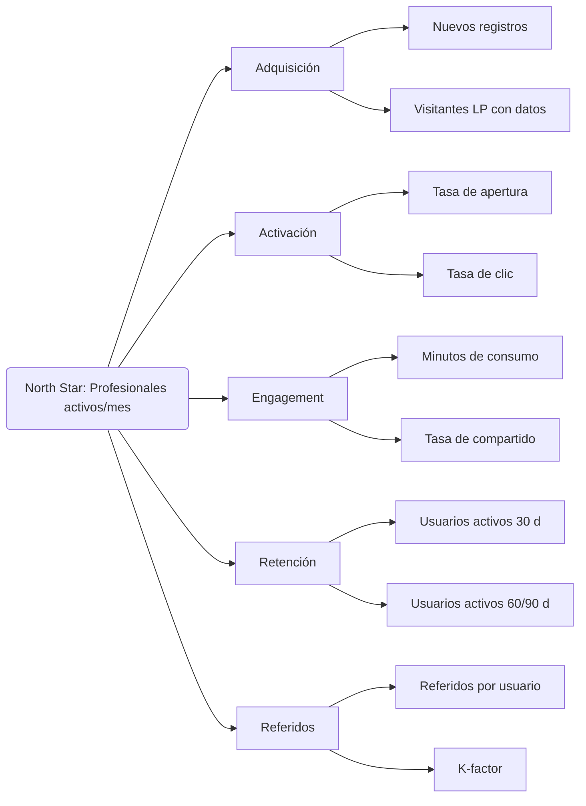

# Visión 2026
Conexión Saludable se transforma en un ecosistema digital que educa, fideliza y conecta a los profesionales de la salud de México, generando comunidad y valor medible para Granvita.

## North Star Metric

> **Profesionales activos al mes con interacción útil**

- **Definición**: número de profesionales de la salud únicos que interactúan con al menos un activo (webinar, podcast, clip, landing, encuesta, referido) en el último mes y que suman puntos en el scoring.  
- **Razonamiento**: este indicador captura la relevancia, la recurrencia y la viralidad del programa. 
- **Objetivo 2026**: lograr un promedio de ≥3 000 profesionales activos/mes y un crecimiento mensual compuesto del 8 %.

## Árbol de KPIs (resumen)

## KPIs de apoyo (métricas insignia IA 10×)
- **ILT (Índice de Liberación de Talento)**: horas liberadas netas por automatización de marketing y generación de contenidos.  
- **TAV (Tiempo a Valor)**: días desde la puesta en marcha hasta la primera conversión de alto valor (p. ej., patrocinio o partner).  
- **VNR (Valor Neto Recurrente)**: ΔIngresos + Ahorros – Costes operativos del programa.  
- **RFE (Reducción de Fricción del Equipo)**: percepción interna (consultores, equipo de e7, Granvita) sobre claridad de procesos y herramientas.  
- **Confiabilidad Operativa**: uptime de automatizaciones y tasa de fallos.
